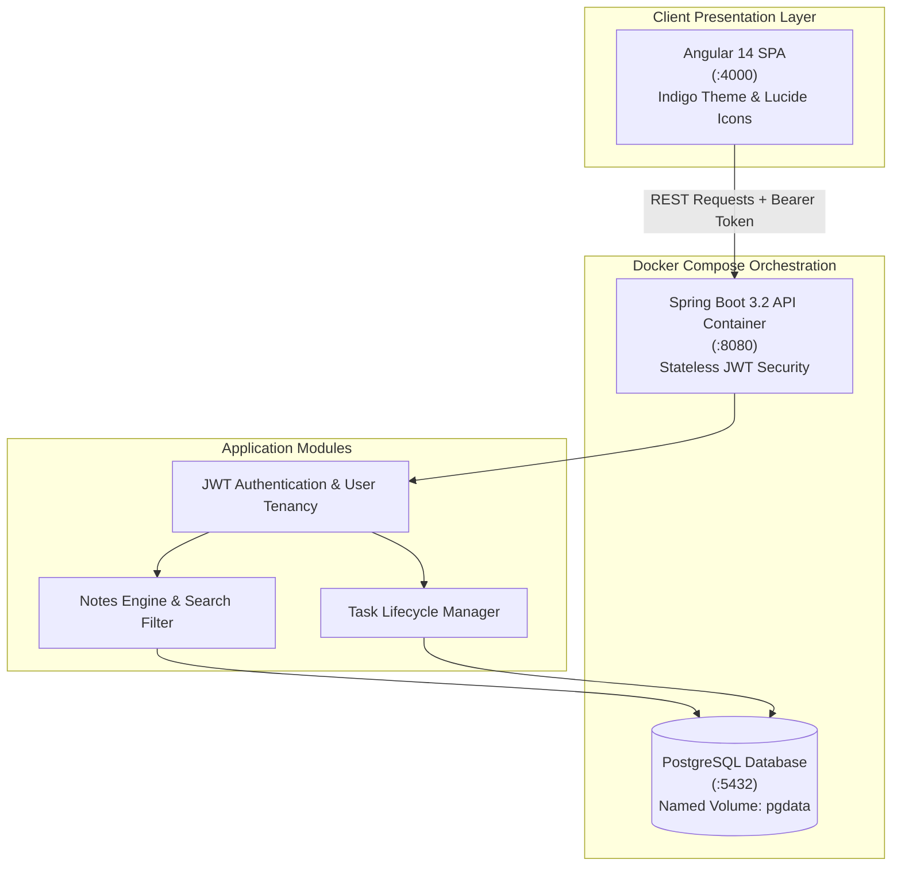

<div align="center">

# LifeOS

**Streamlined Zero-AI Task and Note Management Platform**

<p align="center">
  <a href="https://adoptium.net/"></a>
  <a href="https://spring.io/projects/spring-boot"></a>
  <a href="https://angular.dev/"></a>
  <a href="https://www.docker.com/"></a>
  <a href="https://www.postgresql.org/"></a>
  <a href="LICENSE"></a>
  <a href="#quickstart-with-docker-compose"></a>
</p>

<p align="center">
  Lightweight, distraction-free personal productivity platform.<br>
  Zero AI overhead · 1-command Docker Compose orchestration · Dual-theme design system.
</p>

<p align="center">
  <a href="#quick-flow">Quick Flow</a> •
  <a href="#system-architecture">Architecture</a> •
  <a href="#core-architectural-modules">Core Modules</a> •
  <a href="#quickstart-with-docker-compose">Quickstart</a> •
  <a href="#api-reference">API Reference</a>
</p>

</div>

---

> [!NOTE]
> **Evolutionary Project: Lightweight Zero-AI Variant**
> This repository is **LifeOS**, a streamlined variant of the SecondBrain series.
> While **[secondBrain](https://github.com/tanmayythakare/secondBrain)** provides graph visualization and **[Smart-SecondBrain](https://github.com/tanmayythakare/Smart-SecondBrain)** incorporates AI RAG reasoning with Google Gemini, `LifeOS` is intentionally stripped of AI pipelines and external cloud dependencies for developers who want a fast, minimal, self-hosted productivity system.

---

## Quick Flow

```
docker compose up  →  JWT Auth  →  Manage Notes  →  Organize Tasks  →  Zero-Lag Productivity
```

---

## System Architecture



---

## Core Architectural Modules

### 01. Zero-AI Minimalist Footprint
* **Lightweight Self-Hosting**: Stripped of complex LLM inference, API token limits, and vector databases for instantaneous startup and negligible memory overhead.
* **Deterministic Performance**: Fast search and navigation across tasks and notes with zero network latency to third-party AI APIs.

### 02. Single-Command Container Orchestration
* **Docker Compose Stack**: One command orchestrates the Angular frontend server (`:4000`), Spring Boot backend (`:8080`), and PostgreSQL database (`:5432`).
* **Node-Based Static Delivery**: The frontend operates on a lightweight Node static server, eliminating Nginx configuration complexity.

### 03. Design System and Ergonomics
* **Indigo Color Tokens**: Cohesive design system built around Indigo (`#6366f1`) with first-class light and dark mode toggling.
* **Lucide Icon Integration**: Clean, modern SVG iconography throughout task boards and note workspaces.

### 04. Enterprise Spring Boot Foundation
* **Stateless JWT Security**: Secure user registration, authentication, and data tenancy.
* **OpenAPI Documentation**: Pre-configured Swagger UI available out of the box at `/swagger-ui/index.html`.

---

## Tech Stack

### Backend and Containers
| Technology | Version | Purpose |
| :--- | :--- | :--- |
| **Java** | 17 LTS | Core programming language |
| **Spring Boot** | 3.2.x | Backend application framework |
| **Spring Security** | 6.x | Stateless JWT authentication and authorization |
| **Spring Data JPA** | 3.x | Hibernate Object-Relational Mapping |
| **PostgreSQL** | 14+ | Primary relational datastore |
| **Docker Compose** | 3.x | Multi-container application orchestration |
| **SpringDoc OpenAPI** | 2.x | Swagger UI API contract documentation |

### Frontend
| Technology | Version | Purpose |
| :--- | :--- | :--- |
| **Angular** | 14.x | Component-based Single Page Application |
| **TypeScript** | 4.x | Type-safe development |
| **Lucide Icons** | — | Lightweight SVG iconography |
| **CSS3** | — | Indigo design system with Dark/Light theme toggles |

---

## Quickstart with Docker Compose

Run the entire platform locally with a single command:

```bash
docker compose up --build -d
```

### Access Endpoints
| Service | Endpoint | Description |
| :--- | :--- | :--- |
| **Web Application** | [http://localhost:4000](http://localhost:4000) | Angular 14 SPA |
| **Backend REST API** | [http://localhost:8080](http://localhost:8080) | Spring Boot REST endpoints |
| **Swagger UI Documentation** | [http://localhost:8080/swagger-ui/index.html](http://localhost:8080/swagger-ui/index.html) | Interactive API exploration |
| **PostgreSQL Database** | `localhost:5432` (`lifeos_db`) | Primary database |

To stop and tear down containers:
```bash
docker compose down -v
```

---

### Alternative: Bare-Metal Setup (Without Docker)

1. **Database**: Ensure PostgreSQL is running on `localhost:5432` with database `lifeos_db`, user `lifeos_user`, password `lifeos_password`.
2. **Backend**:
   ```bash
   cd backend
   mvn clean spring-boot:run
   ```
3. **Frontend**:
   ```bash
   cd frontend
   npm install
   npm start
   ```
   Open **http://localhost:4000** in your browser.

---

## API Reference

| Method | Endpoint | Description | Auth Required |
| :--- | :--- | :--- | :---: |
| `POST` | `/api/auth/register` | Register new account | No |
| `POST` | `/api/auth/login` | Authenticate and obtain JWT token | No |
| `GET` | `/api/tasks` | Retrieve user tasks | Yes |
| `POST` | `/api/tasks` | Create new task | Yes |
| `PUT` | `/api/tasks/{id}` | Update task status or title | Yes |
| `DELETE` | `/api/tasks/{id}` | Remove task | Yes |
| `GET` | `/api/notes` | Retrieve user notes | Yes |
| `POST` | `/api/notes` | Create new note | Yes |
| `PUT` | `/api/notes/{id}` | Update note | Yes |
| `DELETE` | `/api/notes/{id}` | Remove note | Yes |

---

## Repository Structure

```
lifeos/
├── docker-compose.yml            # Multi-container orchestration (web, api, db)
├── backend/                      # Spring Boot 3.2 application
│   ├── src/main/java/            # Controllers, Services, Security, Entities
│   ├── src/main/resources/       # application.properties
│   └── pom.xml                   # Maven dependencies
└── frontend/                     # Angular 14 Single-Page Application
    ├── src/app/                  # Tasks, Notes, Auth components & theme services
    └── package.json              # Frontend dependencies
```

---

## Contributing

1. Fork the repository.
2. Clone your fork:
   ```bash
   git clone https://github.com/tanmayythakare/lifeos.git
   ```
3. Create your feature branch:
   ```bash
   git checkout -b feat/your-feature-name
   ```
4. Commit your changes:
   ```bash
   git commit -m "feat: add descriptive feature summary"
   ```
5. Push to your branch and submit a Pull Request.

---

## License

This project is open-source and distributed under the **[MIT License](LICENSE)**.

---

## Author

**Tanmay Thakare**
* GitHub: [@tanmayythakare](https://github.com/tanmayythakare)
* Email: [tanmayrthakare@gmail.com](mailto:tanmayrthakare@gmail.com)
* LinkedIn: [Tanmay Thakare](https://www.linkedin.com/in/tanmaythakare)

---

<div align="center">
  <a href="https://github.com/tanmayythakare">
    
  </a>
</div>
